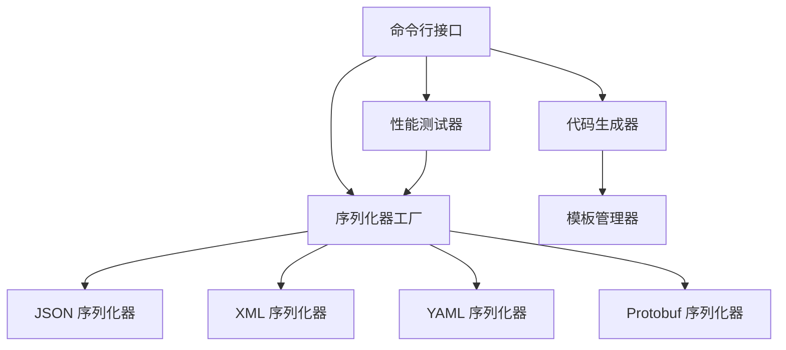

# Serializer 技能技术参考文档

## 1. 技术架构

Serializer 技能采用分层架构设计，将序列化功能与代码生成功能分离，同时支持多种序列化格式和 AOT 编译。

### 1.1 架构层次

- **命令行接口层**：处理命令行参数，调用相应的功能模块
- **核心功能层**：实现序列化和反序列化的核心逻辑
- **序列化器实现层**：针对不同格式的序列化器实现
- **代码生成层**：生成序列化相关的代码
- **配置管理层**：处理配置选项和依赖注入

### 1.2 模块划分

| 模块 | 职责 | 文件位置 |
|------|------|----------|
| 命令行接口 | 解析命令行参数，调用功能模块 | scripts/serializer_core.cs, scripts/serializer_generator.cs |
| 序列化器工厂 | 创建和管理序列化器实例 | scripts/serializer_core.cs |
| JSON 序列化器 | 实现 JSON 序列化和反序列化 | scripts/serializer_core.cs |
| XML 序列化器 | 实现 XML 序列化和反序列化 | scripts/serializer_core.cs |
| YAML 序列化器 | 实现 YAML 序列化和反序列化 | scripts/serializer_core.cs |
| Protobuf 序列化器 | 实现 Protobuf 序列化和反序列化 | scripts/serializer_core.cs |
| 性能测试器 | 测试不同序列化格式的性能 | scripts/serializer_core.cs |
| 代码生成器 | 生成序列化相关的代码 | scripts/serializer_generator.cs |
| 模板管理器 | 管理代码生成模板 | scripts/serializer_generator.cs |

### 1.3 依赖关系



## 2. 核心 API

### 2.1 ISerializer 接口

```csharp
public interface ISerializer
{
    Task<string> SerializeAsync<T>(T value, CancellationToken cancellationToken = default);
    Task<T> DeserializeAsync<T>(string input, CancellationToken cancellationToken = default);
    Task<byte[]> SerializeToBytesAsync<T>(T value, CancellationToken cancellationToken = default);
    Task<T> DeserializeFromBytesAsync<T>(byte[] input, CancellationToken cancellationToken = default);
}
```

**参数说明**：
- `value`：要序列化的对象
- `input`：要反序列化的字符串或字节数组
- `cancellationToken`：取消令牌

**返回值**：
- `SerializeAsync`：返回序列化后的字符串
- `DeserializeAsync`：返回反序列化后的对象
- `SerializeToBytesAsync`：返回序列化后的字节数组
- `DeserializeFromBytesAsync`：返回从字节数组反序列化后的对象

### 2.2 ISerializerFactory 接口

```csharp
public interface ISerializerFactory
{
    ISerializer Create(string format);
    IEnumerable<string> GetSupportedFormats();
}
```

**参数说明**：
- `format`：序列化格式名称，如 "json"、"xml"、"yaml"、"proto" 等

**返回值**：
- `Create`：返回指定格式的序列化器实例
- `GetSupportedFormats`：返回支持的所有序列化格式

### 2.3 IPerformanceTester 接口

```csharp
public interface IPerformanceTester
{
    Task<PerformanceResult> TestPerformanceAsync<T>(int iterations, params string[] formats);
    Task<PerformanceResult> TestPerformanceAsync(Type type, int iterations, params string[] formats);
}
```

**参数说明**：
- `iterations`：测试迭代次数
- `formats`：要测试的序列化格式
- `type`：要测试的类型

**返回值**：
- 返回性能测试结果，包含每种格式的执行时间和内存使用情况

### 2.4 ICodeGenerator 接口

```csharp
public interface ICodeGenerator
{
    Task<string> GenerateSchemaAsync(Type type, string format, CancellationToken cancellationToken = default);
    Task<string> GenerateConverterAsync(Type sourceType, Type targetType, CancellationToken cancellationToken = default);
    Task<string> GenerateSerializerConfigAsync(Type type, string format, CancellationToken cancellationToken = default);
}
```

**参数说明**：
- `type`：目标类型
- `format`：序列化格式
- `sourceType`：源类型
- `targetType`：目标类型
- `cancellationToken`：取消令牌

**返回值**：
- `GenerateSchemaAsync`：返回生成的序列化模式
- `GenerateConverterAsync`：返回生成的类型转换器代码
- `GenerateSerializerConfigAsync`：返回生成的序列化器配置代码

### 2.5 ITemplateManager 接口

```csharp
public interface ITemplateManager
{
    string GetTemplate(string name);
    string RenderTemplate(string template, Dictionary<string, object> parameters);
}
```

**参数说明**：
- `name`：模板名称
- `template`：模板内容
- `parameters`：模板参数

**返回值**：
- `GetTemplate`：返回指定名称的模板
- `RenderTemplate`：返回渲染后的模板内容

## 3. 配置选项

### 3.1 编译配置

#### serializer_core.setting.json

| 配置项 | 说明 | 默认值 |
|--------|------|--------|
| targetFramework | 目标框架 | net10.0 |
| langVersion | C# 语言版本 | preview |
| nullable | 可为空类型检查 | enable |
| optimize | 优化级别 | true |
| publishAot | 启用 AOT 编译 | true |
| trimMode | 裁剪模式 | partial |
| selfContained | 自包含发布 | true |
| publishSingleFile | 发布为单个文件 | true |
| runtimeIdentifier | 运行时标识符 | win-x64 |

#### serializer_generator.setting.json

| 配置项 | 说明 | 默认值 |
|--------|------|--------|
| targetFramework | 目标框架 | net10.0 |
| langVersion | C# 语言版本 | preview |
| nullable | 可为空类型检查 | enable |
| optimize | 优化级别 | true |
| publishAot | 启用 AOT 编译 | true |
| trimMode | 裁剪模式 | partial |
| selfContained | 自包含发布 | true |
| publishSingleFile | 发布为单个文件 | true |
| runtimeIdentifier | 运行时标识符 | win-x64 |

### 3.2 运行配置

#### serializer_core.run.json

| 配置项 | 说明 | 默认值 |
|--------|------|--------|
| commandName | 命令名称 | Project |
| workingDirectory | 工作目录 | $(ProjectDir) |
| environmentVariables | 环境变量 | { "DOTNET_ENVIRONMENT": "Development" } |

#### serializer_generator.run.json

| 配置项 | 说明 | 默认值 |
|--------|------|--------|
| commandName | 命令名称 | Project |
| workingDirectory | 工作目录 | $(ProjectDir) |
| environmentVariables | 环境变量 | { "DOTNET_ENVIRONMENT": "Development" } |

### 3.3 序列化配置

| 配置项 | 说明 | 默认值 | 适用格式 |
|--------|------|--------|----------|
| WriteIndented | 是否缩进输出 | true | JSON |
| IgnoreNullValues | 是否忽略空值 | false | JSON |
| MaxDepth | 最大序列化深度 | 64 | JSON |
| IncludeFields | 是否包含字段 | false | JSON |
| PropertyNamingPolicy | 属性命名策略 | CamelCase | JSON |
| DateTimeFormat | 日期时间格式 | "yyyy-MM-ddTHH:mm:ss.fffffffK" | JSON |

## 4. 命令行接口

### 4.1 serializer_core.exe

#### json 命令

**功能**：处理 JSON 序列化和反序列化

**子命令**：
- `serialize`：序列化对象为 JSON
- `deserialize`：反序列化 JSON 为对象

**参数**：
- `--input`：输入内容或文件路径
- `--output`：输出文件路径
- `--type`：目标类型（仅反序列化时需要）

**示例**：
```bash
# 序列化对象为 JSON
./serializer_core.exe json serialize --input "{\"name\": \"John\", \"age\": 30}" --output output.json

# 反序列化 JSON 为对象
./serializer_core.exe json deserialize --input input.json --type "System.Collections.Generic.Dictionary`2[[System.String],[System.Object]]"
```

#### xml 命令

**功能**：处理 XML 序列化和反序列化

**子命令**：
- `serialize`：序列化对象为 XML
- `deserialize`：反序列化 XML 为对象

**参数**：
- `--input`：输入内容或文件路径
- `--output`：输出文件路径
- `--type`：目标类型（仅反序列化时需要）

**示例**：
```bash
# 序列化对象为 XML
./serializer_core.exe xml serialize --input "{\"name\": \"John\", \"age\": 30}" --output output.xml

# 反序列化 XML 为对象
./serializer_core.exe xml deserialize --input input.xml --type "System.Collections.Generic.Dictionary`2[[System.String],[System.Object]]"
```

#### yaml 命令

**功能**：处理 YAML 序列化和反序列化

**子命令**：
- `serialize`：序列化对象为 YAML
- `deserialize`：反序列化 YAML 为对象

**参数**：
- `--input`：输入内容或文件路径
- `--output`：输出文件路径
- `--type`：目标类型（仅反序列化时需要）

**示例**：
```bash
# 序列化对象为 YAML
./serializer_core.exe yaml serialize --input "{\"name\": \"John\", \"age\": 30}" --output output.yaml

# 反序列化 YAML 为对象
./serializer_core.exe yaml deserialize --input input.yaml --type "System.Collections.Generic.Dictionary`2[[System.String],[System.Object]]"
```

#### protobuf 命令

**功能**：处理 Protobuf 序列化和反序列化

**子命令**：
- `serialize`：序列化对象为 Protobuf
- `deserialize`：反序列化 Protobuf 为对象

**参数**：
- `--input`：输入内容或文件路径
- `--output`：输出文件路径
- `--type`：目标类型（仅反序列化时需要）

**示例**：
```bash
# 序列化对象为 Protobuf
./serializer_core.exe protobuf serialize --input "{\"name\": \"John\", \"age\": 30}" --output output.proto

# 反序列化 Protobuf 为对象
./serializer_core.exe protobuf deserialize --input input.proto --type "System.Collections.Generic.Dictionary`2[[System.String],[System.Object]]"
```

#### test 命令

**功能**：测试序列化性能

**子命令**：
- `performance`：测试序列化性能

**参数**：
- `--type`：测试类型
- `--iterations`：迭代次数
- `--formats`：测试的序列化格式

**示例**：
```bash
# 测试 List<string> 类型的序列化性能
./serializer_core.exe test performance --type "System.Collections.Generic.List`1[[System.String]]" --iterations 10000 --formats "json,xml,yaml,proto"
```

### 4.2 serializer_generator.exe

#### schema 命令

**功能**：生成序列化模式

**参数**：
- `--type`：目标类型
- `--format`：序列化格式
- `--output`：输出文件路径
- `--namespace`：生成代码的命名空间

**示例**：
```bash
# 生成 JSON Schema
./serializer_generator.exe schema --type "System.Collections.Generic.Dictionary`2[[System.String],[System.Object]]" --format json --output schema.json
```

#### converter 命令

**功能**：生成类型转换器

**参数**：
- `--source`：源类型
- `--target`：目标类型
- `--output`：输出文件路径
- `--namespace`：生成代码的命名空间

**示例**：
```bash
# 生成类型转换器
./serializer_generator.exe converter --source "System.Collections.Generic.Dictionary`2[[System.String],[System.Object]]" --target "System.Collections.Generic.Dictionary`2[[System.String],[System.String]]" --output converter.cs
```

#### config 命令

**功能**：生成序列化器配置代码

**参数**：
- `--type`：目标类型
- `--format`：序列化格式
- `--output`：输出文件路径
- `--namespace`：生成代码的命名空间

**示例**：
```bash
# 生成序列化器配置代码
./serializer_generator.exe config --type "System.Collections.Generic.Dictionary`2[[System.String],[System.Object]]" --format json --output serializer_config.cs
```

## 5. 依赖注入

### 5.1 服务注册

Serializer 技能提供了扩展方法来注册服务：

```csharp
// 注册序列化器服务
services.AddSerializer();

// 配置序列化选项
services.ConfigureSerializer(options =>
{
    options.WriteIndented = true;
    options.IgnoreNullValues = true;
    options.PropertyNamingPolicy = JsonNamingPolicy.CamelCase;
});
```

### 5.2 服务使用

在应用中使用序列化器服务：

```csharp
public class MyService
{
    private readonly ISerializerFactory _serializerFactory;
    private readonly IPerformanceTester _performanceTester;

    public MyService(ISerializerFactory serializerFactory, IPerformanceTester performanceTester)
    {
        _serializerFactory = serializerFactory;
        _performanceTester = performanceTester;
    }

    public async Task<string> SerializeDataAsync(object data, string format)
    {
        var serializer = _serializerFactory.Create(format);
        return await serializer.SerializeAsync(data);
    }

    public async Task<object> DeserializeDataAsync(string data, string format, Type type)
    {
        var serializer = _serializerFactory.Create(format);
        var method = typeof(ISerializer).GetMethod("DeserializeAsync").MakeGenericMethod(type);
        return await method.Invoke(serializer, new object[] { data, CancellationToken.None });
    }

    public async Task<PerformanceResult> TestSerializationPerformanceAsync(Type type, int iterations, params string[] formats)
    {
        return await _performanceTester.TestPerformanceAsync(type, iterations, formats);
    }
}
```

## 6. AOT 编译

### 6.1 配置

Serializer 技能支持 AOT 编译，通过以下配置启用：

- `PublishAot=true`：启用 AOT 编译
- `TrimMode=partial`：部分裁剪，保留必要的类型
- `SelfContained=true`：自包含发布
- `PublishSingleFile=true`：发布为单个文件

### 6.2 编译命令

```bash
# 编译 serializer_core.cs
dotnet publish serializer_core.cs -c Release -o publish --self-contained true --publish-single-file true -r win-x64 -p:PublishAot=true -p:TrimMode=partial

# 编译 serializer_generator.cs
dotnet publish serializer_generator.cs -c Release -o publish --self-contained true --publish-single-file true -r win-x64 -p:PublishAot=true -p:TrimMode=partial
```

### 6.3 注意事项

- **反射限制**：AOT 编译对反射有一定限制，需要确保所有使用反射的类型都被正确保留
- **动态类型**：动态类型在 AOT 编译中可能无法正常工作
- **序列化选项**：某些序列化选项可能在 AOT 编译中不可用
- **性能优化**：AOT 编译可以显著提高启动速度和运行时性能

## 7. 性能优化

### 7.1 序列化性能

- **使用 Protobuf**：对于性能敏感的场景，使用 Protobuf 序列化
- **缓存序列化器**：重用序列化器实例，避免重复创建
- **配置优化**：根据需要调整序列化选项，如关闭缩进、启用压缩等
- **类型优化**：使用简单类型，避免复杂的对象图

### 7.2 内存使用

- **流式处理**：对于大型对象，使用流式序列化和反序列化
- **对象池**：使用对象池重用序列化过程中的临时对象
- **内存分配**：减少序列化过程中的内存分配，使用 `Span<T>` 和 `Memory<T>`

### 7.3 启动速度

- **AOT 编译**：使用 AOT 编译提高启动速度
- **预热**：在应用启动时预热序列化器
- **延迟加载**：延迟加载不常用的序列化器

## 8. 故障排除

### 8.1 常见问题

| 问题 | 原因 | 解决方案 |
|------|------|----------|
| 序列化失败 | 类型不支持序列化 | 确保类型是可序列化的，或使用自定义序列化器 |
| 反序列化失败 | 输入格式不正确 | 检查输入格式是否正确，或使用错误处理 |
| AOT 编译错误 | 反射类型未被保留 | 在代码中显式引用类型，或使用 `DynamicDependency` 属性 |
| 性能测试缓慢 | 测试类型过大或迭代次数过多 | 减少测试类型大小，或减少迭代次数 |
| 内存使用高 | 序列化大型对象 | 分块处理大型对象，或使用流式序列化 |
| 命令行参数错误 | 参数格式不正确 | 检查命令行参数格式，使用 `--help` 查看帮助信息 |

### 8.2 日志

Serializer 技能使用 `Microsoft.Extensions.Logging` 提供日志记录，可通过以下方式配置：

```csharp
// 配置日志
var loggerFactory = LoggerFactory.Create(builder =>
{
    builder.AddConsole();
    builder.SetMinimumLevel(LogLevel.Debug);
});

// 创建序列化器工厂
var factory = new SerializerFactory(loggerFactory);
```

## 9. 扩展开发

### 9.1 自定义序列化器

可以通过实现 `ISerializer` 接口来创建自定义序列化器：

```csharp
public class CustomSerializer : ISerializer
{
    public Task<string> SerializeAsync<T>(T value, CancellationToken cancellationToken = default)
    {
        // 实现自定义序列化逻辑
        return Task.FromResult(JsonSerializer.Serialize(value));
    }

    public Task<T> DeserializeAsync<T>(string input, CancellationToken cancellationToken = default)
    {
        // 实现自定义反序列化逻辑
        return Task.FromResult(JsonSerializer.Deserialize<T>(input));
    }

    public Task<byte[]> SerializeToBytesAsync<T>(T value, CancellationToken cancellationToken = default)
    {
        // 实现自定义字节序列化逻辑
        var json = JsonSerializer.Serialize(value);
        return Task.FromResult(Encoding.UTF8.GetBytes(json));
    }

    public Task<T> DeserializeFromBytesAsync<T>(byte[] input, CancellationToken cancellationToken = default)
    {
        // 实现自定义字节反序列化逻辑
        var json = Encoding.UTF8.GetString(input);
        return Task.FromResult(JsonSerializer.Deserialize<T>(json));
    }
}
```

### 9.2 自定义代码生成模板

可以通过扩展 `TemplateManager` 类来添加自定义代码生成模板：

```csharp
public class CustomTemplateManager : TemplateManager
{
    public CustomTemplateManager() : base()
    {
        // 添加自定义模板
        _templates["CustomTemplate"] = @"// 自定义模板
public class {{ClassName}}
{
    // 实现逻辑
}";
    }
}
```

### 9.3 自定义命令

可以通过扩展命令行接口来添加自定义命令：

```csharp
public class CustomOptions : Options
{
    [Option('c', "custom", Required = false, HelpText = "自定义命令参数")]
    public string Custom { get; set; }
}

public class CustomProgram
{
    public static async Task<int> Main(string[] args)
    {
        return await Parser.Default.ParseArguments<CustomOptions>(args)
            .MapResult(
                async (CustomOptions opts) => await RunCommand(opts),
                errors => Task.FromResult(1)
            );
    }

    private static async Task<int> RunCommand(CustomOptions opts)
    {
        // 处理自定义命令
        if (opts.Command == "custom")
        {
            // 实现自定义命令逻辑
            return 0;
        }

        // 处理现有命令
        return await Program.RunCommand(opts);
    }
}
```

## 10. 总结

Serializer 技能是一个功能强大、性能优异的序列化工具，支持多种序列化格式，提供代码生成功能，支持 AOT 编译，适用于各种序列化场景。通过本技术参考文档，开发者可以深入了解 Serializer 技能的架构设计、核心 API、配置选项、命令行接口等内容，从而更好地使用和扩展该技能。

### 10.1 关键特性

- **多格式支持**：JSON、XML、YAML、Protobuf
- **高性能**：优化的序列化和反序列化算法
- **代码生成**：自动生成序列化相关代码
- **AOT 编译**：支持 AOT 编译，提高启动速度和运行时性能
- **跨平台**：支持多种平台
- **灵活配置**：丰富的配置选项
- **依赖注入**：集成 Microsoft.Extensions.DependencyInjection

### 10.2 应用场景

- **API 开发**：序列化和反序列化 API 请求/响应数据
- **配置管理**：读取和写入配置文件
- **数据存储**：将对象序列化为持久化格式
- **网络通信**：在网络传输中序列化数据
- **微服务**：在微服务之间传递数据
- **性能测试**：测试不同序列化格式的性能
- **代码生成**：生成序列化相关的代码

### 10.3 未来规划

- **更多序列化格式**：支持 MessagePack、BSON 等更多序列化格式
- **更多代码生成功能**：生成更多类型的序列化相关代码
- **更高级的性能测试**：提供更详细的性能分析报告
- **更丰富的集成**：与更多框架和库集成
- **更完善的文档**：提供更详细的使用文档和示例

## 11. 参考资料

- [System.Text.Json 文档](https://docs.microsoft.com/en-us/dotnet/standard/serialization/system-text-json/)
- [Newtonsoft.Json 文档](https://www.newtonsoft.com/json/help/html/Introduction.htm)
- [YamlDotNet 文档](https://aaubry.net/pages/yamldotnet.html)
- [protobuf-net 文档](https://protobuf-net.github.io/protobuf-net/)
- [.NET AOT 文档](https://docs.microsoft.com/en-us/dotnet/core/deploying/native-aot/)
- [CommandLineParser 文档](https://github.com/commandlineparser/commandline)
- [ASP.NET Core 序列化](https://docs.microsoft.com/en-us/aspnet/core/web-api/advanced/formatting?view=aspnetcore-8.0)
