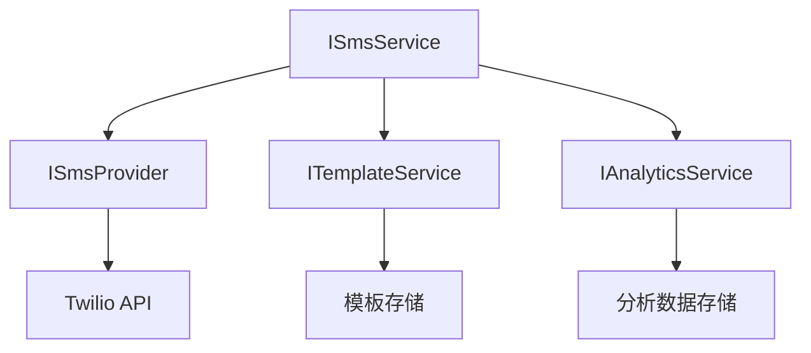

# SMS 技能参考文档

## 技能概述

SMS 技能是一个基于 .NET 10 开发的完整 SMS 消息处理解决方案，支持 AOT 编译，集成了 Twilio 服务提供商，提供了丰富的 SMS 发送、接收、模板管理、批量发送、定时发送和分析功能。

### 主要特性

- **AOT 编译优化**：支持 Ahead-of-Time 编译，提供更快的启动速度和更低的内存占用
- **完整的 SMS 功能**：发送、接收、模板管理、批量发送、定时发送和分析
- **Twilio 集成**：与 Twilio SMS 服务提供商无缝集成
- **Scrutor 支持**：提供高级服务注册和装饰器模式的使用示例
- **命令行接口**：通过 System.CommandLine 提供友好的命令行操作界面
- **依赖注入**：集成 Microsoft.Extensions.DependencyInjection 实现服务管理
- **异步编程**：全面使用 async/await 模式提高性能

## 目录结构

```
sms/
├── index.yaml          # 技能元数据文件
├── SKILL.md            # 技能文档
├── scripts/            # 脚本文件
│   ├── sms_core.cs     # 核心实现文件
│   ├── sms_core.setting.json  # 编译配置文件
│   ├── sms_core.run.json      # 运行配置文件
│   ├── sms_generator.cs  # 代码生成文件
│   ├── sms_generator.setting.json  # 编译配置文件
│   └── sms_generator.run.json      # 运行配置文件
└── reference/          # 参考文档
    ├── README.md       # 参考文档
    └── examples.md     # 使用示例文档
```

## 架构设计

### 核心组件

1. **ISmsProvider**：SMS 服务提供商接口，负责与底层 SMS 服务交互
2. **ITemplateService**：模板服务接口，负责 SMS 模板的管理和渲染
3. **IAnalyticsService**：分析服务接口，负责 SMS 发送数据的收集和分析
4. **ISmsService**：核心 SMS 服务接口，协调各个组件完成 SMS 相关操作

### 依赖关系



### 装饰器模式

SMS 技能使用 Scrutor 实现了装饰器模式，为核心服务添加额外功能：

- **SmsServiceLoggingDecorator**：添加日志记录功能
- **SmsServiceRetryDecorator**：添加失败重试功能
- **SmsServiceValidationDecorator**：添加输入验证功能

## 核心 API 参考

### ISmsProvider 接口

```csharp
public interface ISmsProvider
{
    Task<SmsResult> SendAsync(string to, string message, CancellationToken cancellationToken = default);
    Task<SmsResult> SendWithMediaAsync(string to, string message, IEnumerable<Uri> mediaUrls, CancellationToken cancellationToken = default);
    Task<IEnumerable<SmsMessage>> ReceiveAsync(CancellationToken cancellationToken = default);
}
```

### ITemplateService 接口

```csharp
public interface ITemplateService
{
    Task<string> CreateTemplateAsync(string name, string content, CancellationToken cancellationToken = default);
    Task<IEnumerable<SmsTemplate>> GetTemplatesAsync(CancellationToken cancellationToken = default);
    Task<SmsTemplate> GetTemplateAsync(string templateId, CancellationToken cancellationToken = default);
    Task UpdateTemplateAsync(string templateId, string name, string content, CancellationToken cancellationToken = default);
    Task DeleteTemplateAsync(string templateId, CancellationToken cancellationToken = default);
    Task<string> RenderTemplateAsync(string templateId, Dictionary<string, string> parameters, CancellationToken cancellationToken = default);
}
```

### IAnalyticsService 接口

```csharp
public interface IAnalyticsService
{
    Task RecordSmsEventAsync(SmsEvent @event, CancellationToken cancellationToken = default);
    Task<SmsAnalytics> GetAnalyticsAsync(DateTime startDate, DateTime endDate, CancellationToken cancellationToken = default);
    Task<IEnumerable<SmsEvent>> GetEventsAsync(DateTime startDate, DateTime endDate, CancellationToken cancellationToken = default);
}
```

### ISmsService 接口

```csharp
public interface ISmsService
{
    Task<SmsResult> SendAsync(string to, string message, CancellationToken cancellationToken = default);
    Task<SmsResult> SendTemplateAsync(string to, string templateId, Dictionary<string, string> parameters, CancellationToken cancellationToken = default);
    Task<IEnumerable<SmsResult>> BatchSendAsync(IEnumerable<string> recipients, string message, CancellationToken cancellationToken = default);
    Task<SmsScheduleResult> ScheduleSendAsync(string to, string message, DateTime sendTime, CancellationToken cancellationToken = default);
    Task<SmsAnalytics> GetAnalyticsAsync(DateTime startDate, DateTime endDate, CancellationToken cancellationToken = default);
    Task<IEnumerable<SmsMessage>> ReceiveAsync(CancellationToken cancellationToken = default);
}
```

## 配置选项

### TwilioOptions 配置

| 配置项 | 类型 | 默认值 | 描述 |
|--------|------|--------|------|
| AccountSid | string | "your-twilio-account-sid" | Twilio 账户 SID |
| AuthToken | string | "your-twilio-auth-token" | Twilio 认证令牌 |
| FromNumber | string | "your-twilio-phone-number" | 发件人电话号码 |

### SmsOptions 配置

| 配置项 | 类型 | 默认值 | 描述 |
|--------|------|--------|------|
| BatchSize | int | 100 | 批量发送的批次大小 |
| RateLimitPerSecond | int | 10 | 每秒发送速率限制 |
| TemplateDirectory | string | "./templates" | 模板存储目录 |
| AnalyticsStoragePath | string | "./analytics" | 分析数据存储路径 |

## CLI 命令参考

### 发送命令

```bash
# 发送SMS消息
sms send --to "+1234567890" --message "Hello from SMS Skill!"
```

### 模板命令

```bash
# 创建模板
sms template create --name "welcome" --content "欢迎 {{name}} 使用我们的服务！您的验证码是：{{code}}"

# 列出模板
sms template list
```

### 批量发送命令

```bash
# 批量发送SMS消息
sms batch --file "recipients.txt" --message "重要通知：系统将于明天进行维护升级"
```

### 定时发送命令

```bash
# 定时发送SMS消息
sms schedule --to "+1234567890" --message "提醒：您的会议将在 30 分钟后开始" --time "2024-12-31 23:59:59"
```

### 分析命令

```bash
# 查看SMS发送分析
sms analytics --start "2024-01-01" --end "2024-01-31"
```

## 扩展指南

### 自定义 SMS 提供商

要实现自定义 SMS 提供商，只需实现 `ISmsProvider` 接口：

```csharp
public class CustomSmsProvider : ISmsProvider
{
    public Task<SmsResult> SendAsync(string to, string message, CancellationToken cancellationToken = default)
    {
        // 实现自定义发送逻辑
        return Task.FromResult(new SmsResult { Success = true });
    }

    // 实现其他方法...
}
```

然后在依赖注入配置中注册：

```csharp
services.AddSingleton<ISmsProvider, CustomSmsProvider>();
```

### 添加自定义装饰器

要添加自定义装饰器，实现 `ISmsService` 接口并使用 Scrutor 注册：

```csharp
public class SmsServiceCustomDecorator : ISmsService
{
    private readonly ISmsService _decorated;

    public SmsServiceCustomDecorator(ISmsService decorated)
    {
        _decorated = decorated;
    }

    // 实现接口方法，添加自定义逻辑
    // ...
}
```

注册装饰器：

```csharp
services.Decorate<ISmsService, SmsServiceCustomDecorator>();
```

## 性能优化

### 1. 批量发送优化

- **分批处理**：将大量收件人分成多个批次处理
- **速率限制**：遵循 SMS 服务提供商的速率限制
- **并行处理**：在速率限制范围内使用并行处理提高发送速度

### 2. 内存优化

- **使用 AOT 编译**：减少运行时内存占用
- **对象池**：重用频繁创建的对象
- **异步编程**：减少线程池线程使用

### 3. 网络优化

- **连接池**：重用网络连接
- **重试机制**：智能处理临时网络故障
- **批量 API**：尽可能使用批量 API 减少网络请求

## 部署指南

### AOT 编译部署

1. **编译命令**：
   ```bash
   dotnet publish -c Release -r win-x64 --self-contained true -p:PublishSingleFile=true -p:PublishAot=true
   ```

2. **支持的平台**：
   - Windows (x64, ARM64)
   - Linux (x64, ARM64)
   - macOS (x64, ARM64)

3. **环境变量配置**：
   - `TWILIO_ACCOUNT_SID`：Twilio 账户 SID
   - `TWILIO_AUTH_TOKEN`：Twilio 认证令牌
   - `TWILIO_FROM_NUMBER`：发件人电话号码

### 容器化部署

```dockerfile
FROM mcr.microsoft.com/dotnet/sdk:10.0 AS build
WORKDIR /app

COPY sms/scripts/sms_core.cs .
RUN dotnet publish -c Release -r linux-x64 --self-contained true -p:PublishSingleFile=true -p:PublishAot=true

FROM mcr.microsoft.com/dotnet/runtime-deps:10.0-alpine
WORKDIR /app
COPY --from=build /app/bin/Release/net11.0/linux-x64/publish/ .

ENV TWILIO_ACCOUNT_SID=your-twilio-account-sid
ENV TWILIO_AUTH_TOKEN=your-twilio-auth-token
ENV TWILIO_FROM_NUMBER=your-twilio-phone-number

ENTRYPOINT ["./sms_core"]
```

## 监控和日志

### 日志级别

- **Trace**：最详细的日志，包括所有操作的详细信息
- **Debug**：调试信息，包括关键操作的详细信息
- **Information**：常规信息，包括操作的开始和完成
- **Warning**：警告信息，包括潜在问题
- **Error**：错误信息，包括操作失败的详细信息
- **Critical**：严重错误信息，包括系统级故障

### 关键指标

- **发送成功率**：成功发送的 SMS 数量 / 总发送数量
- **发送延迟**：从请求到发送完成的时间
- **批量发送吞吐量**：单位时间内发送的 SMS 数量
- **错误率**：发送失败的 SMS 数量 / 总发送数量

## 安全注意事项

1. **API 凭证保护**：
   - 不要硬编码 API 凭证
   - 使用环境变量或安全的配置管理系统
   - 定期轮换 API 凭证

2. **数据保护**：
   - 加密存储的电话号码和消息内容
   - 遵循数据保护法规（如 GDPR、CCPA 等）
   - 定期清理不需要的数据

3. **速率限制**：
   - 遵循 SMS 服务提供商的速率限制
   - 实现客户端速率限制，防止滥用

4. **输入验证**：
   - 验证电话号码格式
   - 过滤消息内容，防止注入攻击
   - 限制消息长度

## 故障排除

### 常见错误

| 错误代码 | 描述 | 解决方案 |
|----------|------|----------|
| 21211 | 无效的电话号码格式 | 确保电话号码格式正确，包括国家代码 |
| 21606 | 发件人电话号码未验证 | 在 Twilio 控制台验证发件人电话号码 |
| 21614 | 收件人电话号码为无效号码 | 检查并修正收件人电话号码 |
| 21408 | 账户余额不足 | 向 Twilio 账户充值 |
| 21704 | 速率限制超过 | 降低发送速率或联系 Twilio 增加限制 |

### 排查步骤

1. **检查日志**：查看详细的错误日志，了解具体错误原因
2. **验证配置**：确认 Twilio 凭证和配置参数正确
3. **测试连接**：使用 Twilio 测试工具验证 API 连接
4. **检查网络**：确认网络连接正常，没有防火墙限制
5. **查看 Twilio 控制台**：在 Twilio 控制台查看详细的错误信息

## 常见问题

### Q: 如何处理发送失败的 SMS？

A: SMS 技能提供了重试机制，可以通过 `SmsServiceRetryDecorator` 配置重试策略。对于持续失败的号码，建议记录到单独的列表中进行人工处理。

### Q: 如何提高批量发送的速度？

A: 可以通过以下方式提高批量发送速度：
- 增加 `BatchSize` 配置值
- 在 Twilio 允许的范围内提高 `RateLimitPerSecond`
- 使用 Twilio 的批量发送 API

### Q: 如何实现 SMS 接收功能？

A: SMS 接收通过 Twilio webhook 实现，需要：
1. 在 Twilio 控制台配置 webhook 端点
2. 实现一个 HTTP 服务接收 Twilio 的回调
3. 处理接收到的 SMS 消息

### Q: 如何集成其他 SMS 服务提供商？

A: 可以通过实现自定义 `ISmsProvider` 接口来集成其他 SMS 服务提供商，然后在依赖注入配置中注册。

### Q: 如何监控 SMS 发送状态？

A: 可以通过以下方式监控 SMS 发送状态：
- 使用 Twilio 的状态回调 webhook
- 定期查询 Twilio API 获取发送状态
- 通过 `IAnalyticsService` 收集和分析发送数据

## 总结

SMS 技能是一个功能完整、性能优化的 SMS 消息处理解决方案，基于 .NET 10 和 AOT 编译技术，提供了丰富的功能和友好的使用接口。通过集成 Twilio 服务提供商和 Scrutor 高级服务注册库，它不仅满足了基本的 SMS 发送和接收需求，还提供了模板管理、批量发送、定时发送和分析等高级功能。

无论是用于企业通知、客户服务、验证码发送还是营销活动，SMS 技能都能提供可靠、高效的 SMS 消息处理能力。